# Evolutionary Image Vectorization

An evolutionary approach to image vectorization, based on Genetic Algorithms and Particle Swarm Optimization. Check the [report](./report.pdf) for more details on the implementation.

    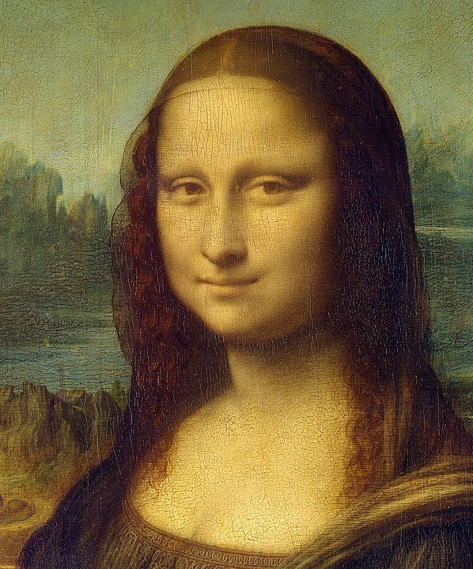
    
    

### Genetic Algorithm
A set of colored and transparent polygons are evolved using a genetic algorithm to reproduce the target image as close as possible. Different improvements are implemented to increase converge speed and final result quality.

    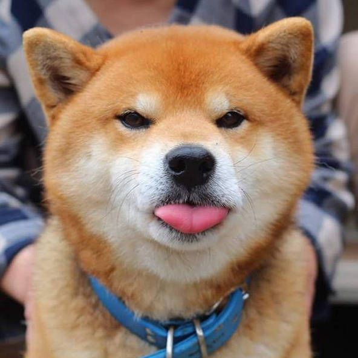
    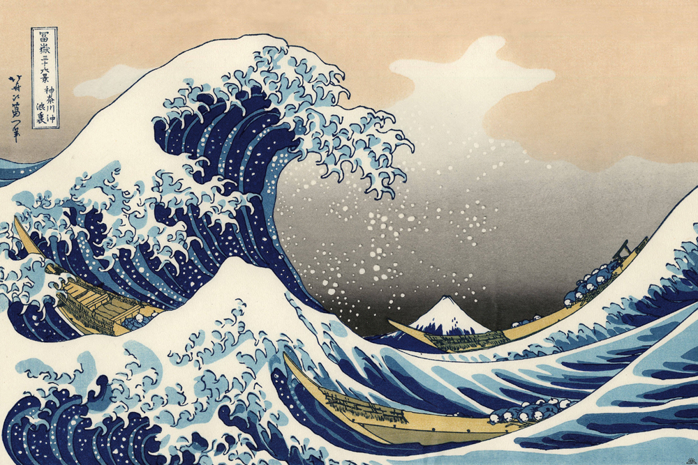
    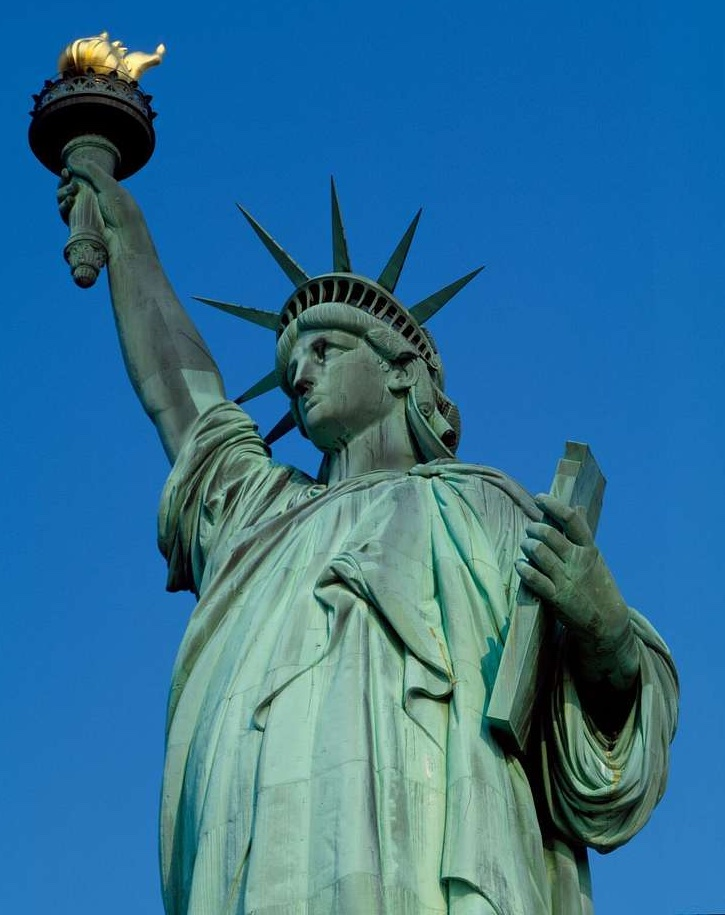
    

    
    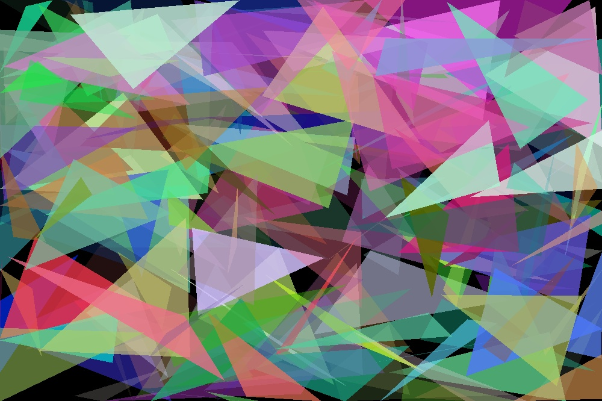
    
    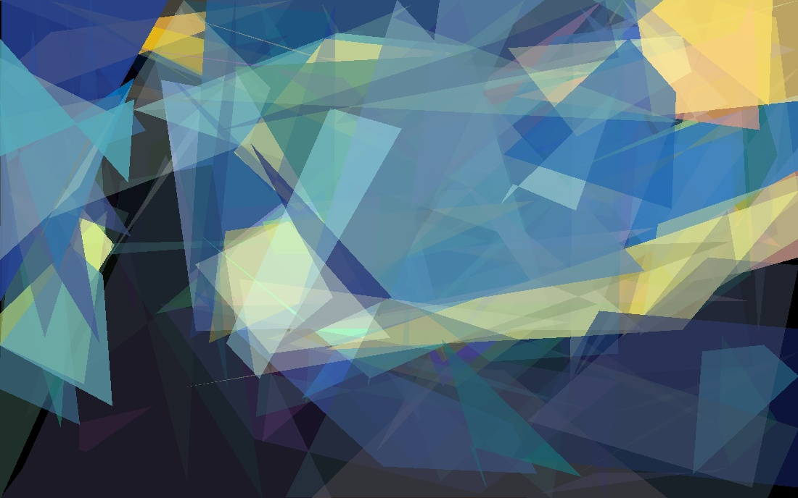

### Particle Swarm Optimization
A set of segments are evolved to reproduce the most relevant contours of the target image. This approach is similar to an edge detection algorithm, with the advantage that the final contours returned are in a vectorized format. 

 

    
    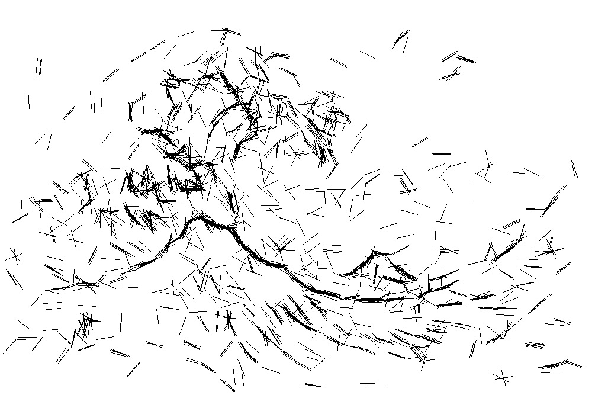
    
    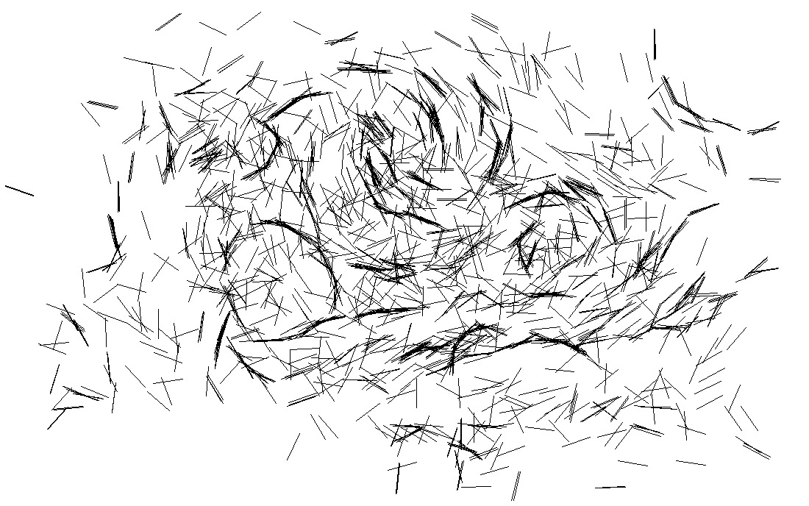

### Video Vectorization
Both algorithms can be also used to vectorize videos:

    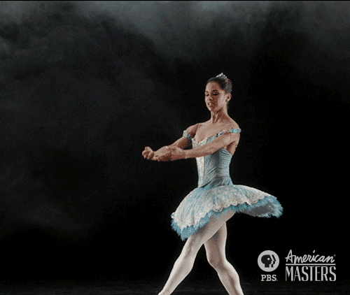
    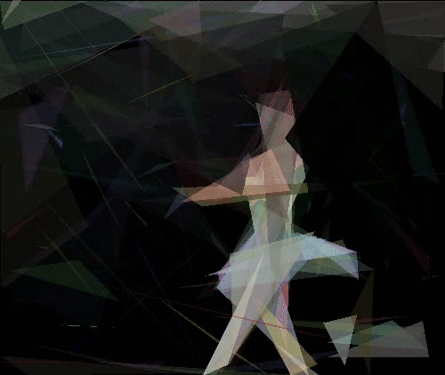
    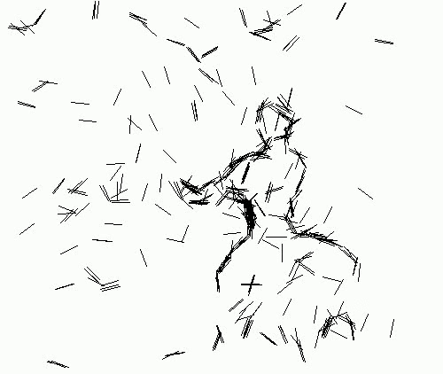

    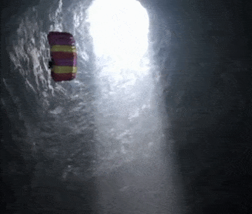
    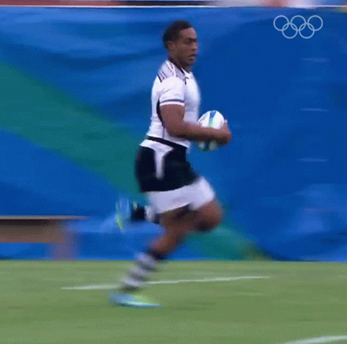
    
    

    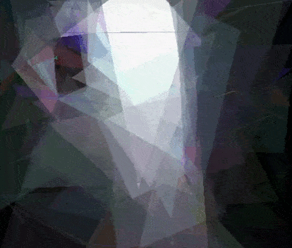
    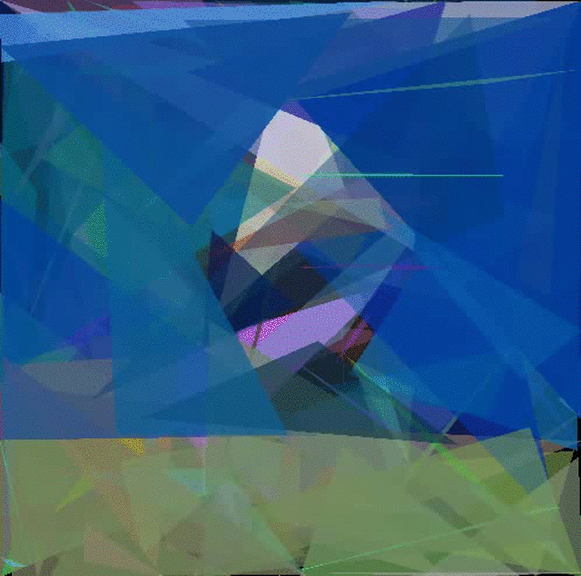
    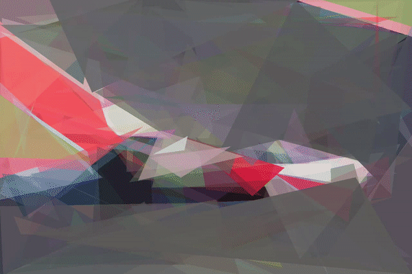
    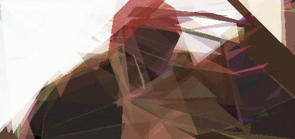

## Get started
- Clone the repository.
- Install the required dependencies by running `pip install -r requirements.txt`.
- Run `main.py [target] [algorithm]`:
    - `target`: the target image file name. Check the `samples` folder for a list of available images. Supports also `.gifs` and `.mp4` files.
    - `algorithm`: the algorithm to use, can be either `GA` or `PSO`.

In `main.py` it is possible to change the hyper-parameters used by each algorithm.

## Project structure
- Folder `classes` contains the implementation of the algorithms, for both GA and PSO.
- Folder `samples` contains a set of sample images that can be used to test the models.
- `main.py` is the main script that can be used to generate the vectorized image for one sample.
- `benchmark.py` can be used to run multiple hyper-parameter combinations and report the results.
