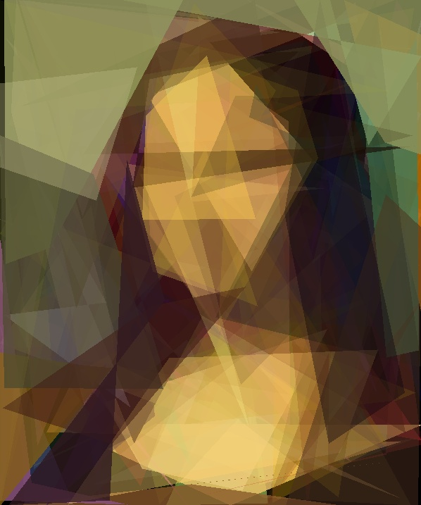
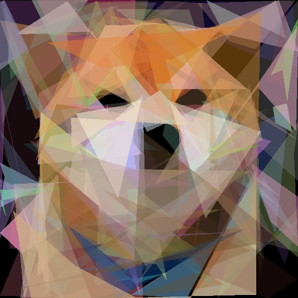
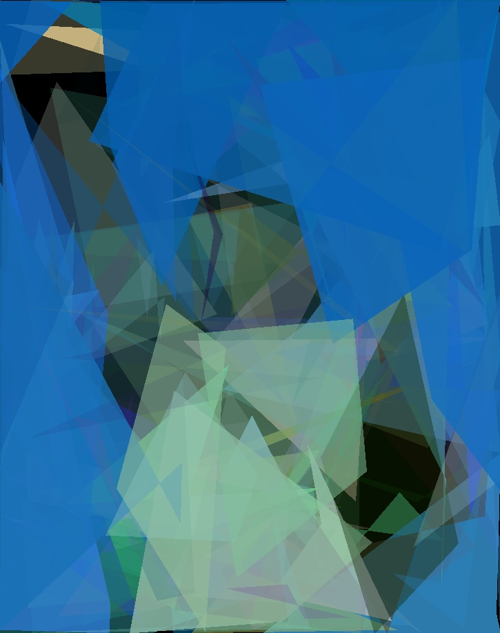
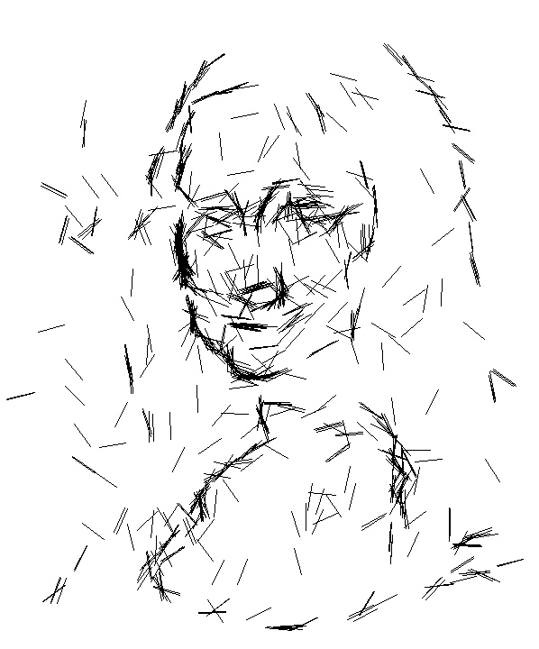
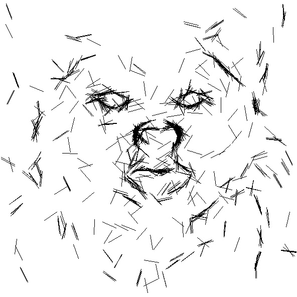
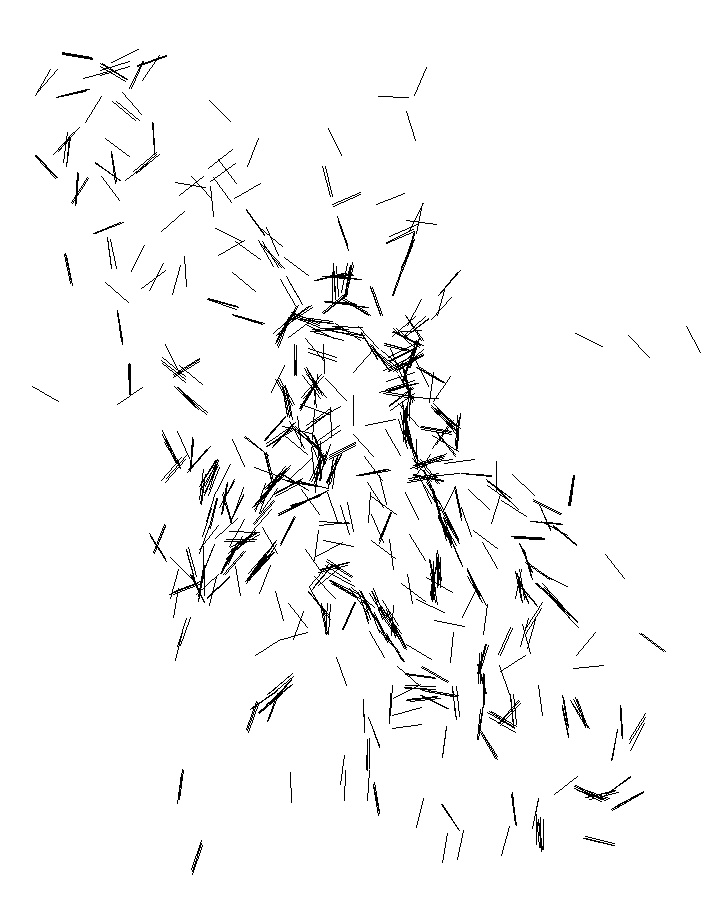

# Evolutionary Image Vectorization

An evolutionary approach to image vectorization, based on Genetic Algorithms and Particle Swarm Optimization.

### Genetic Algorithm
A set of colored and transparent polygons are evolved using a genetic algorithm to reproduce the target image as close as possible. Different improvements are implemented to increase converge speed and the final quality of the results.

    
    
    

### Particle Swarm Optimization
A set of segments are evolved to reproduce the most relevant contours of the target image. This approach is similar to an edge detection algorithm, with the advantage that the final contours returned are in a vectorized format. 
 

    
    
    

## Get started
- Clone the repository
- Install the required dependencies by running `pip install opencv numpy pandas matplotlib numba`
- Run `main.py target algorithm`:
    - `target`: the target image file name. Check the `samples` folder for a list of available
    - `algorithm`: the algorithm to use. Can be either `GA` or `PSO`.

In the `main.py` it is possible to change the hyper-parameters used by each algorithm.

## Project structure
- Directory `classes` contains the implementation of the algorithms, for both GA and PSO. \
- `samples` contains a set of sample images that can be used to test the models.
